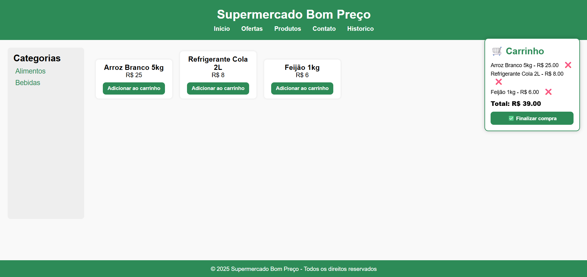

# Sistema simples de Super Mercado
Projeto criado como nota final da cadeira de Programação Web I. Ecolhi este tema, pois sempre tive vontade de fazer algo do tipo.

## Descrição do projeto
Este projeto é simples, possuindo poucas funcionalidades, sendo elas:
- Comprar;
- Adicionar item no carrinho;
- Retirar item do carrinho;
- Ver histórico de vendas.

## Tecnologias utilizadas
- FrontEnd:

   [](https://skillicons.dev)

- BackEnd:

   [](https://skillicons.dev)

- API:
  - SweetAlet2: Para criar a tabela de histórico.

## Design do projeto


## EndPoints do projeto
**Exemplo de EndPoint:** ``http://localhost:8080/produtos``

**Exemplo de resposta**
```json
[
  {
    "id": 1,
    "nome": "Arroz Branco 5kg",
    "preco": 25,
    "validade": "2025-01-01T03:00:00.000Z",
    "id_categoria": 1
  },
  {
    "id": 2,
    "nome": "Refrigerante Cola 2L",
    "preco": 8,
    "validade": "2024-12-01T03:00:00.000Z",
    "id_categoria": 2
  },
  {
    "id": 3,
    "nome": "Feijão 1kg",
    "preco": 6,
    "validade": "2025-07-01T03:00:00.000Z",
    "id_categoria": 1
  }
]
```

**Exemplo de EndPoint:** ``http://localhost:8080/categorias``

**Exemplo de resposta**
```json
[
  {
    "id": 1,
    "nome": "Alimentos"
  },
  {
    "id": 2,
    "nome": "Bebidas"
  }
]
```

**Exemplo de EndPoint:** ``http://localhost:8080/historico``

**Exemplo de resposta**
```json
[
  {
    "id": 1,
    "data": "2025-06-15T00:05:48.179Z",
    "total": 49
  },
  {
    "id": 2,
    "data": "2025-06-22T21:34:01.427Z",
    "total": 25
  }
]
```

**Exemplo de EndPoint:** ``http://localhost:8080/pagamento``

**Exemplo de resposta**
```json
[
  {
    "id": 1,
    "data": "2025-06-15T00:05:48.179Z",
    "total": 49
  },
  {
    "id": 2,
    "data": "2025-06-22T21:34:01.427Z",
    "total": 25
  }
]
```

## Como executar a parte Back-end do projeto

**1. Clonar o projeto ou baixar os arquivo para a sua máquina.**

**2. Instalar as dependências executando o comando abaixo dentro da pasta Back-end:**

```
npm init -y
npm i express
npm i cors
```

**3. Executar o servidor (backEnd) com os comandos:**

```
cd .\backEnd\
npm run dev
``` 

## Funcionalidades
- [x] Comprar;
- [x] Adicionar item no carrinho;
- [x] Retirar item do carrinho;
- [x] Ver histórico de vendas;
- [ ] Adicionar produto a partir do site;
- [ ] Pesquisar por categoria.

## Implementações futuras
- Criar uma função que salve os itens que foram comprados no banco.
- Implementar páginas do header.
- Melhorar o FrontEnd.
- Tornar o site responsivo.

##  Contatos:
Caso queira me pagar algum valor, primeiro me contate em algum desses, para que eu mande uma chave pix aleatória😁.
- Email: guilhermerochasilva019@gmail.com
- LinkedIn: https://www.linkedin.com/in/guilherme-rocha-080831323/